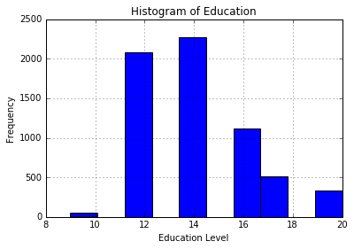
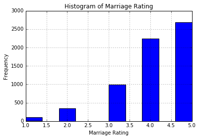

# Групповой проект. Машинное обучение и разработка данных.
### Карпенко Лукутина Данильченко
## Задача
Попробуем определить изменит ли нам жена ? Для этого построим логистическую регрессию на основе данных, Введем булевскую переменную Изменяла ли жена? (1-изменяла, 0- нет)
Использовать будем python и  sklearn.

## Данные

За основу возьмем данные из опроса женщин 1974 года.
6366 опрошенных, и 9 качеств. Данные из Statsmodels:
  * rate_marriage: Оценка брака (1-5)
  * age: Возвраст женщины
  * yrs_married: лет в браке
  * children: количество детей
  * religious: религиозность(1-4)
  * educ: level of education (9 = grade school, 12 = high school, 14 = some college, 16 = college graduate, 17 = some graduate school, 20 = advanced degree)
  * educ: уровень образования (9-20)
  * occupation: род занятий (1-студент... 6 - проффесионал)
  * occupation_husb: Род занятий мужа
  * affairs: количество измен.
## Подключим модули


```python
import numpy as np
import pandas as pd
import statsmodels.api as sm
import matplotlib.pyplot as plt
from patsy import dmatrices
from sklearn.linear_model import LogisticRegression
from sklearn.linear_model import LinearRegression
from sklearn.cross_validation import train_test_split
from sklearn import metrics
from sklearn.cross_validation import cross_val_score
# show plots in the notebook
%matplotlib inline
```

## Загрузка данных
загрузим данные и добавим бинарную характеристику измен.


```python
# load dataset
dta = sm.datasets.fair.load_pandas().data

# add "affair" column: 1 represents having affairs, 0 represents not
dta['affair'] = (dta.affairs > 0).astype(int)
```

## Данные


```python
dta.groupby('affair').mean()
```


<div>
<table border="1" class="dataframe">
  <thead>
    <tr style="text-align: right;">
      <th></th>
      <th>rate_marriage</th>
      <th>age</th>
      <th>yrs_married</th>
      <th>children</th>
      <th>religious</th>
      <th>educ</th>
      <th>occupation</th>
      <th>occupation_husb</th>
      <th>affairs</th>
    </tr>
    <tr>
      <th>affair</th>
      <th></th>
      <th></th>
      <th></th>
      <th></th>
      <th></th>
      <th></th>
      <th></th>
      <th></th>
      <th></th>
    </tr>
  </thead>
  <tbody>
    <tr>
      <th>0</th>
      <td>4.329701</td>
      <td>28.390679</td>
      <td>7.989335</td>
      <td>1.238813</td>
      <td>2.504521</td>
      <td>14.322977</td>
      <td>3.405286</td>
      <td>3.833758</td>
      <td>0.000000</td>
    </tr>
    <tr>
      <th>1</th>
      <td>3.647345</td>
      <td>30.537019</td>
      <td>11.152460</td>
      <td>1.728933</td>
      <td>2.261568</td>
      <td>13.972236</td>
      <td>3.463712</td>
      <td>3.884559</td>
      <td>2.187243</td>
    </tr>
  </tbody>
</table>
</div>


```python
dta.groupby('age').mean()
```


<div>
<table border="1" class="dataframe">
  <thead>
    <tr style="text-align: right;">
      <th></th>
      <th>rate_marriage</th>
      <th>yrs_married</th>
      <th>children</th>
      <th>religious</th>
      <th>educ</th>
      <th>occupation</th>
      <th>occupation_husb</th>
      <th>affairs</th>
      <th>affair</th>
    </tr>
    <tr>
      <th>age</th>
      <th></th>
      <th></th>
      <th></th>
      <th></th>
      <th></th>
      <th></th>
      <th></th>
      <th></th>
      <th></th>
    </tr>
  </thead>
  <tbody>
    <tr>
      <th>17.5</th>
      <td>4.316547</td>
      <td>1.550360</td>
      <td>0.215827</td>
      <td>2.366906</td>
      <td>12.589928</td>
      <td>2.899281</td>
      <td>3.115108</td>
      <td>0.645324</td>
      <td>0.093525</td>
    </tr>
    <tr>
      <th>22.0</th>
      <td>4.238889</td>
      <td>2.724167</td>
      <td>0.373056</td>
      <td>2.336111</td>
      <td>13.911667</td>
      <td>3.261111</td>
      <td>3.486667</td>
      <td>0.928274</td>
      <td>0.225556</td>
    </tr>
    <tr>
      <th>27.0</th>
      <td>4.126359</td>
      <td>5.851890</td>
      <td>0.970482</td>
      <td>2.328845</td>
      <td>14.660798</td>
      <td>3.503884</td>
      <td>3.959089</td>
      <td>0.819545</td>
      <td>0.327809</td>
    </tr>
    <tr>
      <th>32.0</th>
      <td>4.048644</td>
      <td>12.233863</td>
      <td>2.029935</td>
      <td>2.475210</td>
      <td>14.333957</td>
      <td>3.498597</td>
      <td>4.062675</td>
      <td>0.548795</td>
      <td>0.397568</td>
    </tr>
    <tr>
      <th>37.0</th>
      <td>3.941640</td>
      <td>16.880915</td>
      <td>2.771293</td>
      <td>2.586751</td>
      <td>13.960568</td>
      <td>3.484227</td>
      <td>4.045741</td>
      <td>0.448880</td>
      <td>0.425868</td>
    </tr>
    <tr>
      <th>42.0</th>
      <td>3.955864</td>
      <td>21.632409</td>
      <td>3.013871</td>
      <td>2.683480</td>
      <td>14.104666</td>
      <td>3.543506</td>
      <td>4.095839</td>
      <td>0.348074</td>
      <td>0.385876</td>
    </tr>
  </tbody>
</table>
</div>


## Визуализация данных


```python
# histogram of education
dta.educ.hist()
plt.title('Histogram of Education')
plt.xlabel('Education Level')
plt.ylabel('Frequency')
```


    <matplotlib.text.Text at 0x11a275e10>





```python
# histogram of marriage rating
dta.rate_marriage.hist()
plt.title('Histogram of Marriage Rating')
plt.xlabel('Marriage Rating')
plt.ylabel('Frequency')
```


    <matplotlib.text.Text at 0x11a3396a0>





## Подготовка данных
Добавим столбцы для каждого рода деятельности( так как это фактически бинарные признаки, хоть у нас в данных они представлены числом)


```python
# create dataframes with an intercept column and dummy variables for
# occupation and occupation_husb
y, X = dmatrices('affair ~ rate_marriage + age + yrs_married + children + \
                  religious + educ + C(occupation) + C(occupation_husb)',
                  dta, return_type="dataframe")
X = X.rename(columns = {'C(occupation)[T.2.0]':'occ_2',
                        'C(occupation)[T.3.0]':'occ_3',
                        'C(occupation)[T.4.0]':'occ_4',
                        'C(occupation)[T.5.0]':'occ_5',
                        'C(occupation)[T.6.0]':'occ_6',
                        'C(occupation_husb)[T.2.0]':'occ_husb_2',
                        'C(occupation_husb)[T.3.0]':'occ_husb_3',
                        'C(occupation_husb)[T.4.0]':'occ_husb_4',
                        'C(occupation_husb)[T.5.0]':'occ_husb_5',
                        'C(occupation_husb)[T.6.0]':'occ_husb_6'})
# flatten y into a 1-D array
y = np.ravel(y)
print (X.columns)

```

    Index(['Intercept', 'occ_2', 'occ_3', 'occ_4', 'occ_5', 'occ_6', 'occ_husb_2',
           'occ_husb_3', 'occ_husb_4', 'occ_husb_5', 'occ_husb_6', 'rate_marriage',
           'age', 'yrs_married', 'children', 'religious', 'educ'],
          dtype='object')


## Запуск логистической регрессии


```python
# instantiate a logistic regression model, and fit with X and y
model = LogisticRegression()
model = model.fit(X, y)

# check the accuracy on the training set
model.score(X, y)
```


    0.72588752748978946


Мы получили 73 процента аккуратности, что кажется хорошим результатом.


```python
y.mean()
```


    0.32249450204209867


Но говоря всегда, что девушка не изменяет мужу, у нас будет аккураность 68 процентов, что не сильно хуже.
Выведем коэффициенты значимости признаков


```python
# examine the coefficients
t =0
for i in X.columns:
    print('%s     %f'% (i,np.transpose(model.coef_)[t][0]))
    t+=1
```

    Intercept     1.489884
    occ_2     0.188046
    occ_3     0.498926
    occ_4     0.250647
    occ_5     0.838983
    occ_6     0.833921
    occ_husb_2     0.190547
    occ_husb_3     0.297745
    occ_husb_4     0.161319
    occ_husb_5     0.187683
    occ_husb_6     0.193917
    rate_marriage     -0.703120
    age     -0.058418
    yrs_married     0.105677
    children     0.016920
    religious     -0.371135
    educ     0.004016


Как мы видим, самое важное, сделать так чтобы Ваша жена была довольна браком!

Протестируем нашу регрессию на данных о моей девушке, ей 21, пусть мы в браке 1 год, у нас нет детей, она закончила университет и она учитель, муж программист.


```python
model.predict_proba(np.array([1, 1, 0, 0, 0,0, 0, 0, 0, 0, 1, 4, 21, 1, 0, 1,16]).reshape(1,-1))

```


    array([[ 0.70655793,  0.29344207]])


Вероятность измены моей девушки, чуть меньше среднего! Ура!
Спасибо за внимание!
